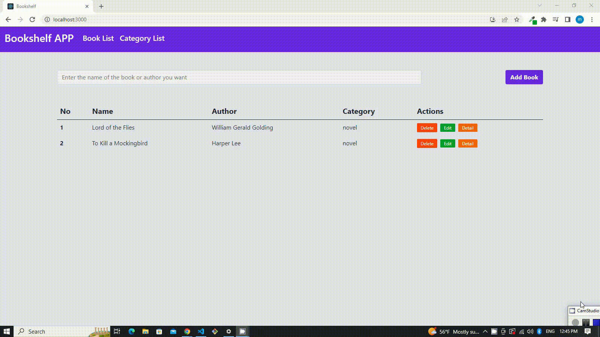

## Bookshelf App

### In this project I've used different libraries such as Bootstrap, React, React-router-dom, Redux-for state management and Json Server as a fake API.

In this application I have tried to create very handy bookshelf app.
You can add, edit, delete books and categories and see the number of books in terms of category.
You can search the name of books and authors as well.

## Screen Gif

